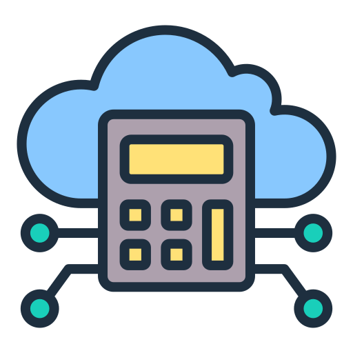

# Bootcamp Data Analytics - WoMakers Code

O Bootcamp Data Analtytics é uma formação afirmativa para mulheres cisgênero e transgênero que será oferecido de forma 100% online e gratuita, em parceria com Potência Tech iFood e S&P Global Foundation, visando acelerar a empregabilidade de 200 mulheres na área de dados e apoiá-las na conexão com mercado de trabalho.

Serão 27 semanas (Janeiro - Julho de 2024) de formação técnica e mentoria de carreira para apoiar a formação profissional das participantes e ajudá-las na empregabilidade no mercado tech. A WoMakersCode é responsável pelo processo de contato, seleção, acompanhamento e implantação do Bootcamp Data Analytics.

<h1 align="center">
  
  
  
  
  
  
</h1>

## Cronograma de Conteúdo do Curso

- **Semana 1:** Boas vindas
- **Semana 2:** Onboarding
- **Semana 3:** Mercado de Dados
- **Semana 4:** Métodos Ágeis
    - Cultura Ágil
    - SCRUM
    - Kanban
- **Semana 5:** Git e GitHub
- **Semana 6:** Python para Dados
    - Numpy
    - Pandas
    - Data Wrangling
    - Sklearn Pipelines
    - ETL
    - [Desafio Final Python para Dados](https://github.com/bdlzjulia/desafio_pandas_numpy/blob/main/Python_para_Dados_Desafio_Final.ipynb) 
- **Semana 7:** Banco de Dados SQL
    - SQLite
- **Semana 8:** Estatística com Python parte 1: Frequências e Medidas
- **Semana 9:** Estatística com Python parte 2: Probabilidade e Amostragem
- **Semana 10:** Estatística com Python parte 3: Testes de hipóteses
- **Semana 11:** Estatística com Python parte 4: Correlação e Regressão
- **Semana 12:** Regressão Logística: Modelos de Classificação
- **Semana 13:** Data Visualization: criando gráficos com bibliotecas Python
- **Semana 14:** Data Analysis com Google Sheets
- **Semana 15:** Power BI
- **Semana 16:** Computação em Nuvem
- **Semana 17:** Preparação para processos seletivos
- **Semana 18:** Projeto final
